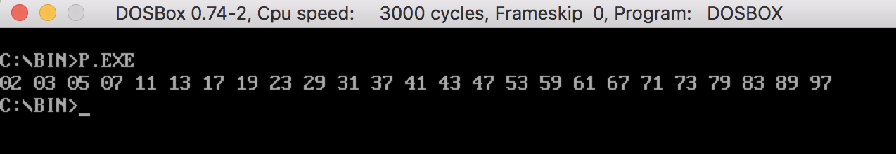
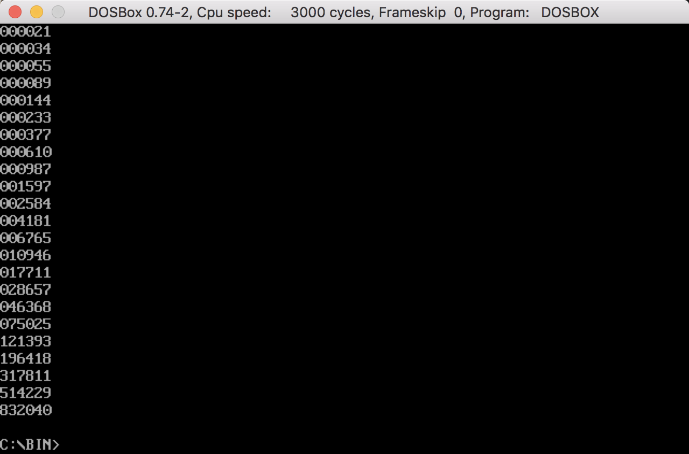
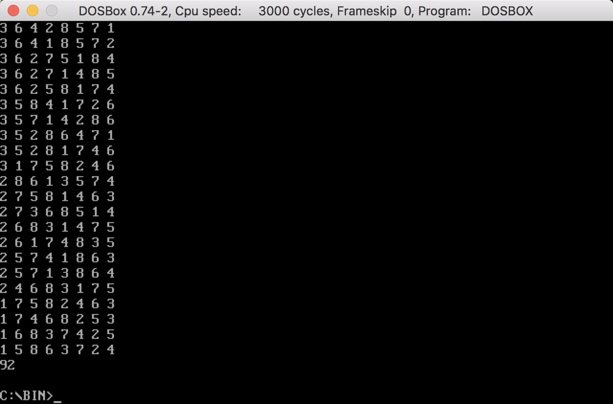

# 学生信息
 - 学号：2016302580055
 - 姓名：了然
 - github项目地址：https://github.com/LLipter/assembly

# 如何运行代码

我这些代码都是放到一个叫做`DosBox`的模拟环境中，然后配合tasm工具进行编译、运行。

具体来说，假设`tasm`工具和代码放在`/Users/xxx/tasm`的位置。那么首先打开`DosBox`。

1. 利用`mount`命令加载存放工具和代码的文件夹. 

	`mount c /Users/xxx/tasm`.

2. 切换工作目录到存放代码的文件夹中
	
	`c:`
	
	`cd bin`

3. 用tasm编译源代码

	`tasm xxx.asm`

4. 用tlink链接代码

	`tlink xxx.obj io.obj`
	
5. 运行程序

	`xxx.exe`
	
# 质数问题

汇编语言的运行结果见上图
	
# 斐波那契数列问题

因为斐波那契数列的增长速度比较快，第三十项肯定会超过16位整数能表达的范围，所以需要自己构造更大数据结构。

~~~asm
FL      DW      30  DUP(0)              ; lower part of result
FH      DW      30  DUP(0)              ; high part of result
~~~

我在代码中开辟了两块16比特的空间，拼在一起形成一个32位的大整数数据结构。值得一提的是，在汇编语言中，将二进制数字转换成十进制然后打印出来，这样一个操作都十分有难度，而打印本题中这样的32位整数难度则又变大了。

汇编语言的运行结果见上图

# 八皇后问题

首先我们可以把这样一个在二维棋盘上的问题降维，转化为一个可以在一维数组上解决的等价问题，这样可以极大地简化计算，降低程序设计的难度，提高算法效率。

考虑这样一个推论。对于所有合法的解来说，八位皇后都不能在同一横行上。如果把皇后的位置通过坐标的方式表现出来的,`(xi,yi)`代表第i位皇后的坐标。那么八位皇后的`xi`数值必须互不相同，考虑到棋盘只有8*8，也就是说八位皇后的`xi`坐标值写在一起的话应该是一个1~8的全排列。假设我们每次都把八位皇后进行排序，把他们按照`xi`坐标递增的顺序写下来，那么就会发现结果一定是`1 2 3 4 5 6 7 8`，是按顺序排列的。既然每一个合法的解按我们这样排列后`xi`坐标的排序都是相同的，那么就没有必要保留这一个数字了，只需要记录八个`yi`的数值便能够代表一种棋盘排布。如此便降维成功，转化成了一个一维的排列问题。其实本质上是隐含排在第i位的皇后的横坐标一定是i。

同理，对于所有合法的解来说，纵坐标的数值也不能相同。也就是说我们只需要在1-8全排列的空间内搜索合法解即可。现在已经满足了互不同行，互不同列。那么接下来只需要满足互向不在斜线的位置上就行了。也就是说，对于任意不相等的i和j来说，要满足以下的表达式，其中loc[i]代表第i个皇后的位置。

`|i - j| != |loc[i] - loc[j]|`

实际上计算的时候，我采用了带回溯的深度优先搜索算法，我同时写了c++语言的版本和汇编语言的版本，分别在`queen.cpp`和`queen.asm`中。二者使用的算法完全相同。

八皇后问题一共有92个解。汇编语言的运行结果见上图

